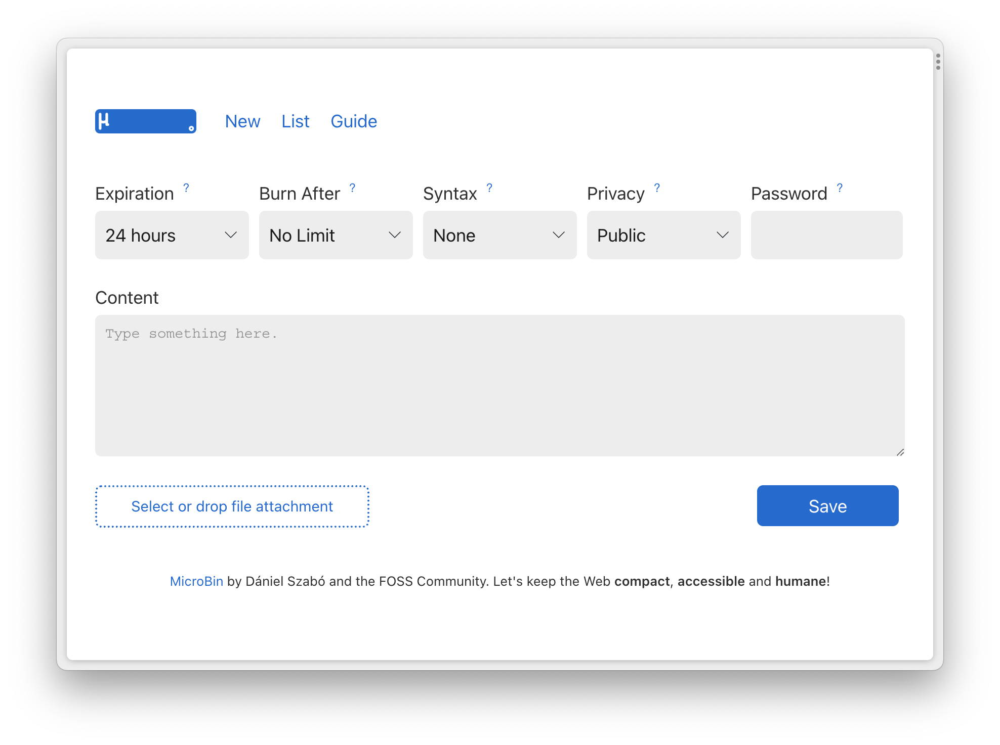

<!--
N.B.: This README was automatically generated by <https://github.com/YunoHost/apps/tree/master/tools/readme_generator>
It shall NOT be edited by hand.
-->

# MicroBin for YunoHost

[](https://dash.yunohost.org/appci/app/microbin)  

[](https://install-app.yunohost.org/?app=microbin)

*[Read this README in other languages.](./ALL_README.md)*

> *This package allows you to install MicroBin quickly and simply on a YunoHost server.*  
> *If you don't have YunoHost, please consult [the guide](https://yunohost.org/install) to learn how to install it.*

## Overview

MicroBin is a super tiny, feature rich, configurable, self-contained and self-hosted paste bin web application. It is very easy to set up and use, and will only require a few megabytes of memory and disk storage.

**Shipped version:** 2.0.4~ynh1

**Demo:** <https://pub.microbin.eu/>

## Screenshots



## Documentation and resources

- Official app website: <https://microbin.eu/>
- Upstream app code repository: <https://github.com/szabodanika/microbin>
- YunoHost Store: <https://apps.yunohost.org/app/microbin>
- Report a bug: <https://github.com/YunoHost-Apps/microbin_ynh/issues>

## Developer info

Please send your pull request to the [`testing` branch](https://github.com/YunoHost-Apps/microbin_ynh/tree/testing).

To try the `testing` branch, please proceed like that:

```bash
sudo yunohost app install https://github.com/YunoHost-Apps/microbin_ynh/tree/testing --debug
or
sudo yunohost app upgrade microbin -u https://github.com/YunoHost-Apps/microbin_ynh/tree/testing --debug
```

**More info regarding app packaging:** <https://yunohost.org/packaging_apps>
